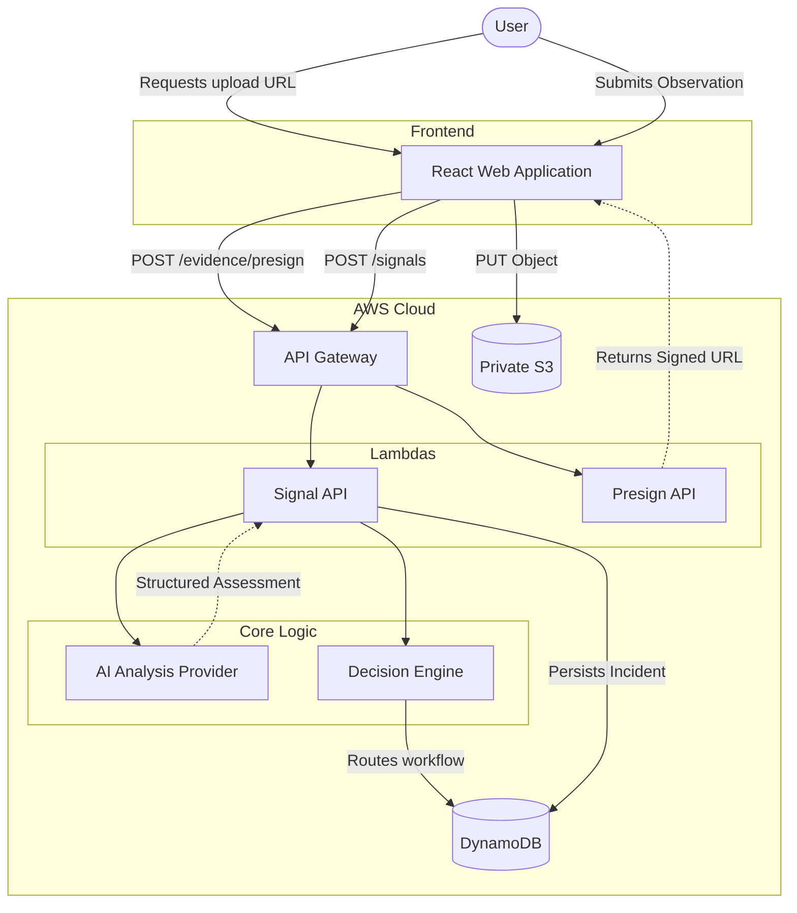

# Report-to-Me AI

**AI-powered guidance for understanding real-world observations and deciding what to safely do next.**

Traditional reporting systems are designed merely to collect forms and build backlogs. Report-to-Me AI is an intelligent interface designed to interpret unstructured human observations, assess potential risks, and provide actionable safety guidance. It acts as a digital safety net, evaluating whether an issue can be safely self-resolved, requires longitudinal monitoring, or demands human authorization and intervention.


## What makes Report-to-Me different?

Traditional reporting systems primarily collect observations. Generic AI assistants can explain an individual situation, but the model itself should not be trusted to directly control sensitive application workflows. 

Report-to-Me combines:
**Observation** → **AI interpretation** → **Structured assessment** → **Deterministic decision policy** → **Actionable guidance** → **Monitoring / human review**

The model interprets the context. Deterministic software strictly controls the workflow. Humans remain responsible for sensitive actions.

## Example Scenarios

### Self-solve
> **"The tap in Classroom 204 is leaking slightly."**

A low-risk, highly actionable observation. The AI assesses this as low severity, and the decision engine routes it to self-solve. The user receives practical guidance on how to secure the area or report it to maintenance, without escalating to an emergency workflow.

### Monitor
> **"The fan in Classroom 204 is making a strange grinding noise."**

An issue that doesn't pose an immediate risk but may develop into one. The AI flags uncertainty or moderate risk factors. The decision engine routes it to monitor rather than immediately escalating. 

### Human review
> **"There is a fight near the main gate."**

A higher-risk, sensitive situation. The AI detects critical risk factors and high severity. The deterministic decision engine forces this into a human review queue. The system provides the user with safe guidance but does **not** autonomously contact emergency services or execute sensitive real-world actions.

## Architecture



The AI Analysis Layer uses a provider abstraction. The current deployment configuration can use a deterministic development analyzer for rapid iteration, while managed model inference (e.g., Amazon Bedrock) is configured and enabled separately. 

### AWS Architecture Decisions

| Requirement | AWS Service | Why |
|-------------|-------------|-----|
| **HTTP API** | API Gateway | Managed serverless HTTP entry point supporting CORS and routing. |
| **Application logic** | Lambda | Event-driven execution without always-on servers. |
| **Incident state** | DynamoDB | Serverless low-latency structured persistence via single-table design. |
| **Evidence** | S3 | Durable object storage enabling direct, secure browser uploads. |
| **AI analysis** | AI Provider Abstraction | Separates model inference from strict application workflow code. |
| **Infrastructure** | AWS SAM | Reproducible infrastructure as code for serverless resources. |

The architecture is explicitly designed to be **elastic and cost-conscious**. Large media payloads are uploaded directly from the browser to an S3 private bucket via server-generated presigned URLs. Media bytes never pass through the Lambda execution boundary, ensuring the compute tier remains lean and extremely fast. Workflow states and metadata are heavily structured and persisted efficiently in a DynamoDB single-table design.

## Decision Engine

The AI model does not directly control the final workflow state. It acts strictly as an analytical input layer:

```text
AI Provider
 ├── understands context
 ├── classifies category
 ├── assesses severity
 └── recommends guidance
         │
         ▼
Deterministic Decision Engine
 ├── self_solve
 ├── monitor
 └── human_review
```

### Severity ≠ Confidence

The system enforces a strict distinction between severity and confidence:
- **Severity** describes the potential danger or impact of a situation.
- **Confidence** describes how certain the AI is about its own assessment.

A high-severity situation assessed with low confidence requires fundamentally different routing than a high-severity situation assessed with high confidence.

## Data Model

The backend utilizes DynamoDB Single-Table Design to represent the domain:

- **Signal**: The raw observation (text and location) from the user.
- **Incident**: The interpreted, aggregated situation resulting from the signal.
- **Evidence**: Attached media metadata securely pointing to S3 objects.
- **Decision**: The specific workflow path chosen by the deterministic policy.

**Key Schema Overview:**
- `PK: INCIDENT#<incidentId>`, `SK: META` (Incident State)
- `PK: INCIDENT#<incidentId>`, `SK: SIGNAL#<signalId>` (Raw Signal Payload)
- `PK: INCIDENT#<incidentId>`, `SK: DECISION` (Engine Decision)
- `PK: INCIDENT#<incidentId>`, `SK: EVIDENCE#<evidenceId>` (S3 Evidence Pointer)
- `PK: SIGNAL#<signalId>`, `SK: META` (Pointer for direct signal lookups)

## Evidence Flow

```text
Browser
   │ (1) request upload authorization
   ▼
API Gateway
   │
   ▼
Presign Lambda
   │ (2) generate restricted upload access
   ▼
Presigned S3 URL
   │ (3) direct PUT object
   ▼
Private S3 bucket
   │ (4) evidence metadata appended to signal
   ▼
Signal API → DynamoDB
```

Sending media directly to S3 demonstrates an intentional serverless pattern. Large media streams are not sent through API Gateway or Lambda, saving significant compute costs and avoiding API Gateway payload limits.

## Security & Responsible AI

The system is designed to reduce risk by strictly enforcing boundaries around AI behavior and data access:

- **No Autonomous Emergency Dispatch**: High-risk situations require human review. The AI cannot trigger alarms or dispatch responders.
- **Deterministic Routing**: Workflow decisions are strictly controlled by auditable software code, not generative AI.
- **Structured AI Output**: Model responses are strictly validated against JSON schemas before being passed to the Decision Engine.
- **Private S3 Storage**: All evidence is stored in buckets that explicitly block public access.
- **Presigned Uploads**: The backend strictly controls exactly where and how files are uploaded via short-lived AWS presigned URLs.
- **Server-Generated Object Keys**: S3 keys are securely generated by the server. The browser cannot dictate arbitrary S3 paths.
- **IAM Scoping**: Each Lambda function operates with strictly scoped least-privilege permissions.

## Project Structure

```text
.
├── backend/
│   ├── app/
│   │   ├── ai/            # AI Provider abstraction
│   │   ├── api/
│   │   ├── config/
│   │   ├── domain/        # Enums and core Pydantic classes
│   │   ├── handlers/      # Lambda HTTP entrypoints
│   │   ├── repositories/  # DynamoDB persistence layer
│   │   ├── services/      # Signal Processor & Decision Engine
│   │   └── utils/
│   ├── tests/
│   └── requirements.txt
├── frontend/
│   ├── src/               # React / TypeScript Application
│   └── package.json
├── template.yaml          # AWS SAM Infrastructure
└── README.md
```

## Getting Started

### Prerequisites
- Node.js 18+
- Python 3.10
- AWS CLI (configured)
- AWS SAM CLI (and optionally Docker)

### Local Development and Deployment

Deploy the serverless infrastructure using AWS SAM:

```bash
sam build --use-container
sam deploy --guided
```
*(The `--use-container` flag ensures Python dependencies are compiled natively for the AWS Lambda Linux runtime.)*

After deployment, SAM will output the API Gateway `ApiUrl`. Use this to configure the frontend.

### Frontend

Configure your local environment using the `ApiUrl` output from the SAM deployment.

```bash
cd frontend
cp .env.example .env.local
```

Edit `.env.local`:
```env
VITE_API_BASE_URL=https://<your-api-id>.execute-api.us-east-1.amazonaws.com/v1/api/v1
```

Start the Vite dev server:
```bash
npm install
npm run dev
```

## API Overview

| Method | Route | Purpose |
|--------|-------|---------|
| `GET`  | `/api/v1/health` | Verify API availability and active configuration. |
| `POST` | `/api/v1/signals` | Submit observation and execute core ingestion pipeline. |
| `POST` | `/api/v1/evidence/presign` | Obtain a short-lived S3 upload authorization URL. |
| `GET`  | `/api/v1/incidents` | Retrieve a list of recent incidents. |
| `GET`  | `/api/v1/incidents/{id}` | Retrieve full details and nested signals for a specific incident. |
| `GET`  | `/api/v1/signals/{id}` | Retrieve the original raw signal payload. |

**Signal Submission Example:**
```json
{
  "source": {
    "type": "text", 
    "content": "The tap is leaking."
  }, 
  "evidence": [
    {
      "evidenceId": "server-id", 
      "objectKey": "key", 
      "contentType": "image/jpeg", 
      "size": 1024
    }
  ]
}
```

## Testing

Backend unit tests run via pytest:
```bash
cd backend
python -m venv .venv
source .venv/bin/activate
pip install -r requirements.txt
pytest
```

Frontend builds strongly-typed TypeScript validation:
```bash
cd frontend
npm run build
```

## Current Capabilities

### Available now
- Unstructured text and image evidence ingestion
- Blob-to-S3 direct presigned uploads
- Structured incident analysis abstraction layer
- Deterministic routing decision engine
- Self-solve / Monitor / Human-review workflows
- DynamoDB single-table incident persistence
- Fully serverless elastic AWS deployment

### In development / planned
- Transcribed voice evidence integration
- Longitudinal and emerging incident intelligence (graph analysis)
- Real-time human review dashboards

## Known Limitations

- **AI Provider Configuration**: The AI layer is provider-abstracted. The current repository configuration uses a deterministic development analyzer by default to facilitate rapid testing. Managed model inference (Amazon Bedrock) is fully implemented but requires environment activation.
- **Windows Deployment**: AWS Lambda uses a Linux runtime. Running `sam build` natively on Windows fetches `.pyd` native binaries for packages like `pydantic-core` which fail on Lambda. Developers on Windows must use `sam build --use-container` or a compatible WSL environment to correctly package Linux `.so` wheels.

## Design Principles

- **AI interprets. Software decides. Humans authorize.**
- **Observation is not automatically an incident.**
- **Severity is not confidence.**
- **Repeated observations can reveal developing problems.**
- **The safest automation is automation with clear boundaries.**
