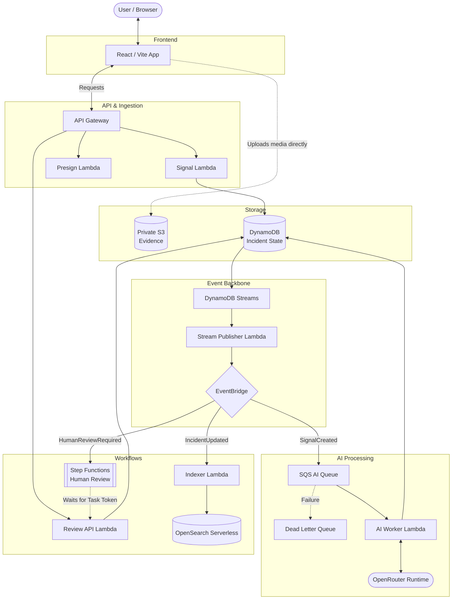
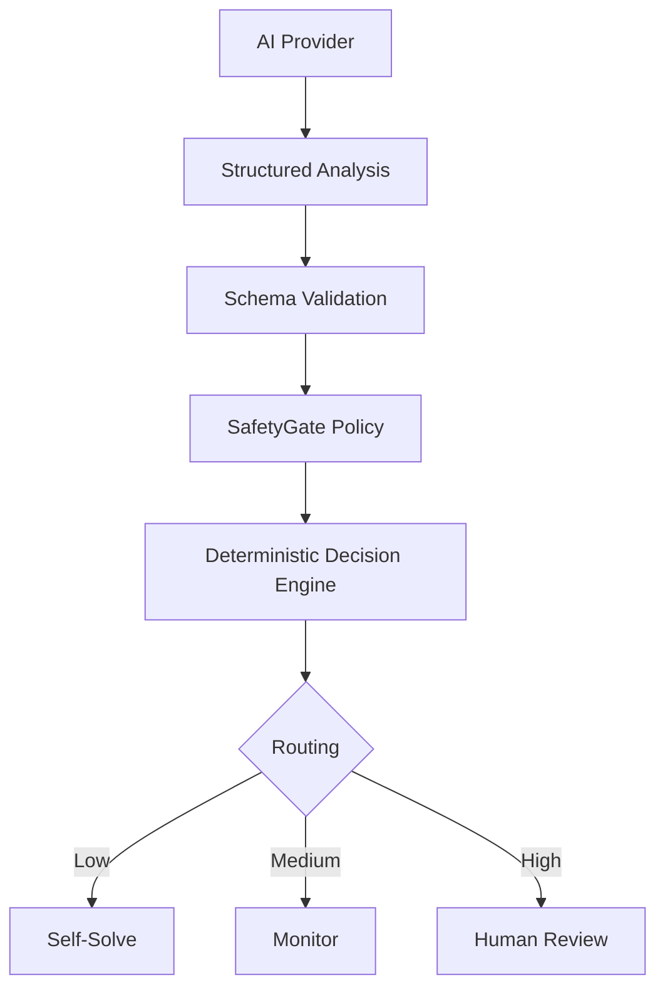
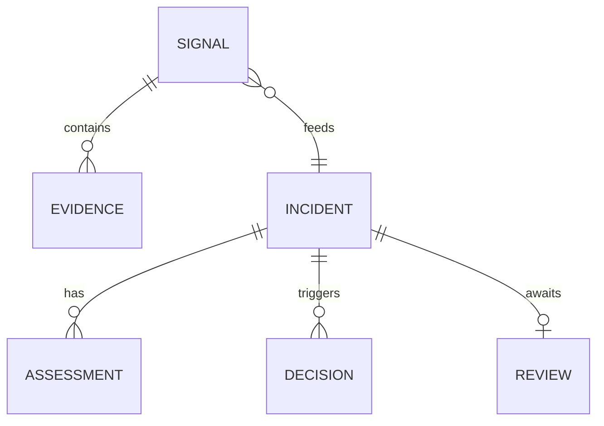
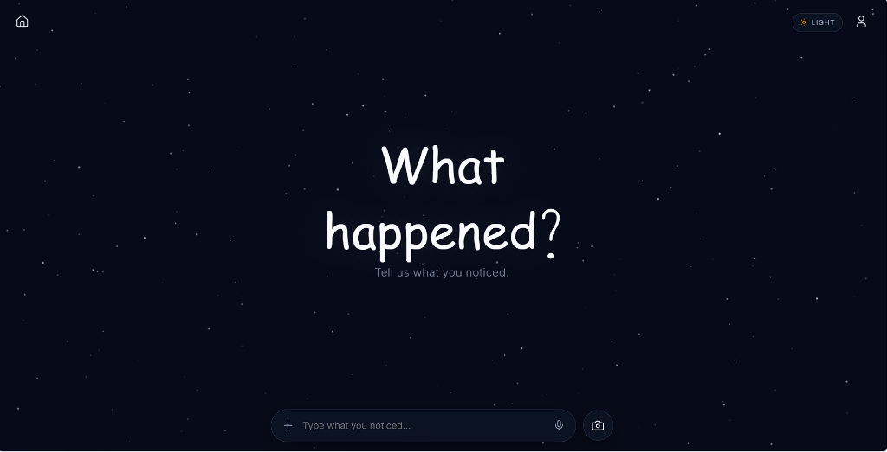
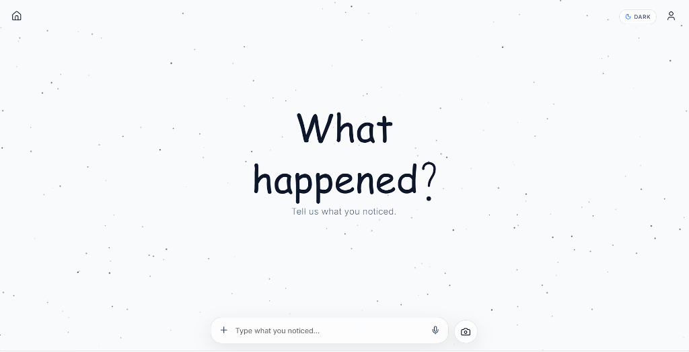
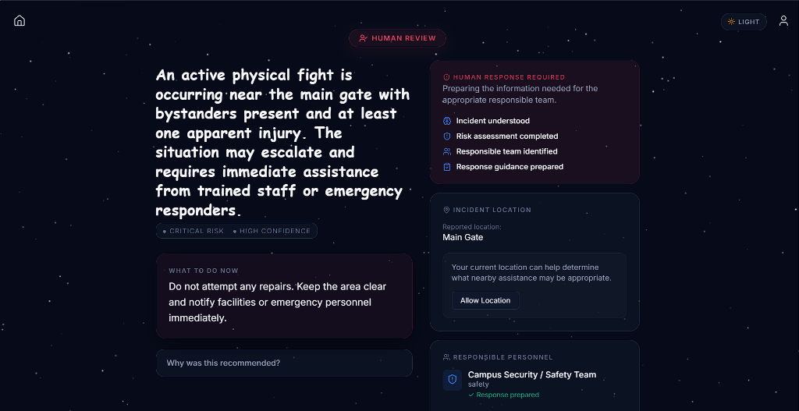
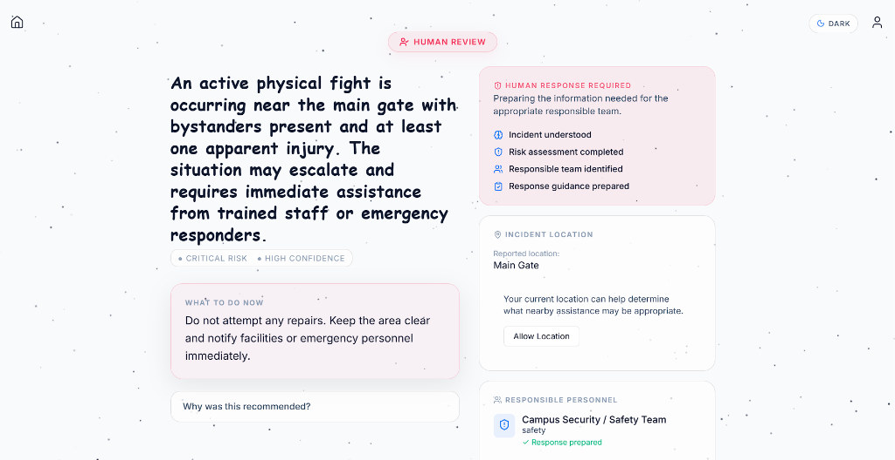

# Report-to-Me AI

**An AI-powered guidance and decision system for real-world observations.**


Reporting systems expect users to understand incident management, risk models, and escalation workflows before they ever ask for help. Report-to-Me AI flips this completely: **All the user needs to do is report what is happening.** They simply describe what they see, hear, or experience, and the system intelligently figures out the rest.

> **AI interprets. Software decides. Humans authorize sensitive actions.**

---

## The Idea

Report-to-Me AI is not primarily an incident reporting form. It is an operational guardian layer that takes the burden of decision-making off the user. 

From the user's perspective, the flow is incredibly simple:

```text
You notice something
        ↓
Tell Report-to-Me AI what is happening
        ↓
AI understands the situation
        ↓
Risk + context are assessed
        ↓
The system determines the appropriate path
        ↓
You get clear guidance
        ↓
Self-solve / Monitor / Human Review
```

---

## Three Core Outcomes

The system deterministically routes observations into one of three paths:

### 01 — SELF-SOLVE
*   **Example:** *"The tap in Classroom 204 is leaking slightly."*
*   **Outcome:** Low-risk and actionable. The system provides practical guidance immediately without unnecessary escalation.

### 02 — MONITOR
*   **Example:** *"Several students have reported that the fan in Classroom 204 has been making an increasingly loud grinding noise."*
*   **Outcome:** Repeated observations can reveal a developing incident. The system identifies the relevant responsible team and maintains context to monitor the trend over time.

### 03 — HUMAN REVIEW
*   **Example:** *"There is a physical fight happening near the main gate. Someone may be injured."*
*   **Outcome:** High-risk situation. The system provides immediate safety guidance, identifies the responsible security personnel, requests explicit location permission, and stages a human-handoff. **The AI does not autonomously dispatch emergency responders.**

---

## The "Agent" Concept

The intended agent behavior is simple. 
**User:** *"I don't know what this is or what I should do. This is what I am seeing."*
**System:** *"I'll understand it, assess it, determine the appropriate workflow, give you safe guidance, and prepare the next step."*

We strictly distinguish between what is implemented today and our future vision:

**CURRENT PROTOTYPE:**
*   Understands unstructured observations via AI.
*   Assesses severity and confidence.
*   Generates structured guidance.
*   Deterministic software decides the routing.
*   Supports self-solve, monitor, and human-review paths.
*   Prepares a human handoff and requests explicit location permission.
*   **Does NOT** autonomously execute sensitive external actions.

**FUTURE CLOSED-LOOP VISION:**
*   Active organizational directory integration.
*   Real external communication channels (SMS, dispatch).
*   Richer multimodal reasoning (video/audio).
*   Longitudinal incident intelligence and follow-up.
*   Authorized workflow execution.

---

## Actual Deployed Architecture

This is a real event-driven, serverless system deployed on AWS. 



### Why Each AWS Service Exists

| Requirement | AWS Service | Architectural Reason |
|-------------|-------------|----------------------|
| **Public Edge** | API Gateway | Provides secure HTTP boundary and routing for backend functions. |
| **Compute** | AWS Lambda | Handles ingestion, presigning, AI orchestration, and indexing serverlessly. |
| **State** | DynamoDB | Authoritative, durable source of truth for incident state and metadata. |
| **CDC** | DynamoDB Streams | Turns persisted state changes into observable events. |
| **Routing** | EventBridge | Decouples downstream capabilities (AI, indexing, workflows) from ingestion. |
| **Buffer** | SQS & DLQ | Decouples ingestion from async AI analysis, absorbing provider latency and ensuring zero data loss on failure. |
| **Orchestration** | Step Functions | Provides durable human-in-the-loop orchestration via pause-and-resume task tokens. |
| **Media Storage** | Amazon S3 | Large evidence uploads bypass API Gateway/Lambda using short-lived presigned URLs. |
| **Memory** | OpenSearch Serverless | Provides derived lexical search projection for incident memory. |
| **IaC** | AWS SAM | Reproducible, template-driven infrastructure deployment. |

---

## Explicit AI Architecture

**The LLM is NOT the workflow controller.** 

The AI's job is purely to understand, extract facts, assess severity/confidence, and recommend guidance. The deterministic software layer validates the output, applies safety policies, dictates the workflow, and persists state.



### Severity ≠ Confidence
A crucial architectural distinction is separating risk from model certainty:
*   **Severity:** The potential real-world impact or danger.
*   **Confidence:** How certain the model is about its interpretation.
*   *Why it matters:* A high-severity event with low AI confidence must absolutely trigger human review, preventing the system from ignoring a dangerous situation just because it is ambiguous.

---

## Current AI Runtime Configuration

The application uses an AI-provider abstraction so inference can be swapped without changing the workflow engine. **The current deployed prototype uses OpenRouter with the Nex N2.5 Pro model.** The workflow remains strictly provider-agnostic. 

*(Note: Amazon Bedrock was configured and evaluated as an AWS-native inference path, but the current account environment lacks model invocation authorization. Rather than coupling the product to a single model provider, inference is isolated behind an abstraction, allowing the deployed prototype to function seamlessly via OpenRouter).*

---

## What is Actually Working

This isn't just a README architecture diagram. This system is actually exercised end-to-end.

**Verified Path:** Public frontend → API Gateway → DynamoDB → SQS → AI Worker → OpenRouter → SafetyGate → Decision Engine → DynamoDB.

| Observation | AI Assessment | Final Workflow |
|-------------|---------------|----------------|
| *"The faucet in the restroom is leaking."* | Low Severity, High Confidence | `self_solve` |
| *"The elevator is making a grinding noise."* | Medium Severity, High Confidence | `monitor` |
| *"There's a physical fight at the main gate."* | Critical Severity, High Confidence | `human_review` |

*(See `/benchmark-results/` for exact structured outputs from evaluation runs).*

---

## Human Handoff & High-Risk Experience

When the deterministic Decision Engine identifies a high-risk event, it triggers the `human_review` flow. 

1. User reports the situation.
2. AI identifies risk.
3. SafetyGate/policy constrains the workflow.
4. Engine routes to Step Functions for human review.
5. System prepares context for a human responder.
6. **Location is requested with explicit browser permission.**
7. **Human authorization is required before any sensitive external action.**

### Conceptual High-Risk UI State:
> 🚨 **HIGH RISK DETECTED**
> 
> **What happened:** Possible physical altercation near main gate.
> **Assessment:** CRITICAL RISK · HIGH CONFIDENCE
> **What to do now:** Stay at a safe distance and do not intervene.
> **Responsible personnel:** Campus Safety / Security
> **Location:** Main Gate (Permission requested).
> 
> **Handoff Status:** Ready for human authorization.
> ✓ Incident summary prepared | ✓ Risk assessment prepared | ✓ Guidance prepared

*This is a prototype handoff experience. External contact/dispatch is not autonomously executed.*

---

## Safety & Responsible AI

**AI proposes. Software governs. Humans authorize.**

*   **Schema Validation:** AI output is strictly coerced via Pydantic schemas.
*   **Deterministic Routing:** AI cannot directly mutate workflow state.
*   **No Autonomous Dispatch:** Sensitive actions require explicit human approval via Step Functions.
*   **Least-Privilege:** Backend components use strictly scoped IAM roles.
*   **Secure Evidence:** Media is uploaded directly to a private S3 bucket using temporary, server-generated presigned URLs.

---

## Data Model

The domain is structured around a single-table, event-driven design to ensure transactional integrity while allowing asynchronous capabilities to branch off safely.



---

## Media & Multimodal Input

Users can currently provide observations via **text** and **image upload** (using native camera capture or file selection via S3 presigned URLs). 

*While users can provide rich visual evidence today, deeper multimodal reasoning (like analyzing video frames or transcribing audio) is dependent on the active AI provider and is targeted for future iterations.*

---

## Product UX

The interface abandons the traditional "form" in favor of an **agent workspace**.

*"Tell us what is happening. We'll help determine what comes next."*

### The Agentic Interface

*A radically simple interface with minimal input friction.*


*Cinematic typography and a calm "thinking" state.*

### Human Review Workflow

*High-risk situations route to an operational dashboard.*


*Displays AI understanding alongside clear operational next steps without false claims of successful external actions.*

---

## Current Limitations

This is a prototype boundary. The following limitations are deliberate design choices for this phase:

*   **No Autonomous External Dispatch:** The system successfully prepares handoffs but is not yet wired to actually dial 911 or text real responders.
*   **Provider Latency:** Asynchronous OpenRouter inference times can vary based on model load.
*   **Lexical Memory:** Memory retrieval currently relies on BM25/lexical search via OpenSearch, not dense vector embedding.
*   **Identity & Authentication:** The prototype focuses on the incident workflow and does not yet implement a full authenticated responder directory or multi-tenancy.

---

## Future Vision 🚀

*   **Phase 1 (Current):** Observation ingestion, AI understanding, deterministic decision engine, human review, memory.
*   **Phase 2:** Monitor, correlate, and detect emerging incidents.
*   **Phase 3:** Human handoff with responsible-person routing and authenticated organizational directories.
*   **Phase 4:** Authorized integrations with real communication channels and institutional systems.
*   **Phase 5:** A closed-loop agent with explicit human governance for follow-up and closure.

---

## Why This Architecture?

*   **Why Event-Driven?** Decoupling ingestion from processing ensures resilience. If the AI provider goes down, the API stays up.
*   **Why DynamoDB?** Serverless, predictable access patterns, perfect for workflow state.
*   **Why S3 Presigned Uploads?** Prevents large media payloads from overwhelming API Gateway and Lambda limits.
*   **Why SQS?** Isolates AI processing, absorbs provider latency, and allows dead-letter queuing for failures.
*   **Why Step Functions?** Provides a highly durable, human-in-the-loop workflow using task token authorization.
*   **Why a Deterministic Decision Engine?** AI is probabilistic; workflows must be deterministic. This guarantees auditability and safety boundaries.

---

## Repository, Deployment & API

### Local Setup / Getting Started

**Prerequisites:** AWS CLI, AWS SAM CLI, Node.js (v18+), and an [OpenRouter API Key](https://openrouter.ai/).

**1. Deploy the Backend**
```bash
git clone https://github.com/jackso1328/report-to-me-ai.git
cd report-to-me-ai
sam build
sam deploy --guided
```
*Set `AIProvider` to `openrouter` and securely add your API key to the `AiWorkerFunction` environment variables.*

**2. Run the Frontend**
```bash
cd frontend
npm install
cp .env.example .env
```
*Set `VITE_API_URL` to your SAM deployment output, then run `npm run dev`.*

### Repository Structure
```
report-to-me-ai/
├── backend/            # Python Lambda functions, API, models, Decision Engine
├── frontend/           # React / TypeScript Vite application
├── template.yaml       # AWS SAM IaC definition
├── docs/               # Documentation and images
└── LICENSE             # MIT License
```

---

## 2-3 Minute Demo Script

If you are evaluating this project, try this sequence:

*   **00:00 — Problem:** "Reporting systems collect forms. They don't help people understand what to do."
*   **00:20 — Self-solve:** Submit *"The faucet is leaking."* Watch the system give actionable self-solve guidance.
*   **00:50 — Monitor:** Submit *"The elevator sounds like it is grinding again."* Watch it assign the issue to facilities and monitor it.
*   **01:20 — High-risk:** Submit *"There's a fire in the hallway."*
*   **01:45 — Human handoff:** Watch the system orchestrate the Human Review workflow, request location, identify safety personnel, and safely stage the human handoff without autonomous dispatch.
*   **02:10 — Architecture:** Review the event-driven SAM pipeline in the code.
*   **02:30 — Closing:** "Report-to-Me AI turns an uncertain real-world observation into a governed next step."

---

> *"People should not need to know what to do before asking for help. They only need to report what is happening. The system's job is to understand it, assess it, guide the user, monitor what develops, and bring the right human into the loop when the situation demands it.*
>
> *AI interprets. Software decides. Humans authorize sensitive actions."*

---

## License
Licensed under the MIT License. See [LICENSE](LICENSE) for details.
