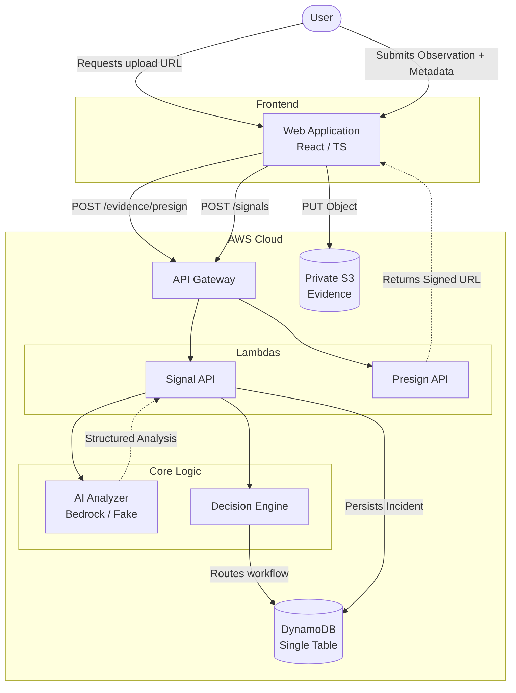

# Report-to-Me AI

Report-to-Me AI helps people understand real-world situations and decide what they can safely do next.

Traditional reporting systems are primarily designed to collect forms. Report-to-Me AI is an intelligent interface designed to interpret unstructured human observations (text, voice, and media), assess potential risks, and provide actionable, safe guidance back to the user. It evaluates whether an observation can be safely self-resolved, whether it indicates an emerging problem that needs monitoring, or whether it requires human authorization and intervention. 

**AI interprets. Software decides. Humans authorize sensitive actions.**


## The Idea

Traditional reporting systems primarily collect reports for a backlog. Report-to-Me AI is designed to help someone understand:
- What appears to be happening
- How serious it may be
- What can safely be done now
- What should be monitored
- When human assistance is appropriate

The system is designed around providing *guidance* rather than executing autonomous interventions. It provides a safety net for users who are unsure how to handle a situation. 

## How it works

The core loop of the system:
1. **Observe**: A user submits unstructured text, voice, or image evidence.
2. **Understand**: The AI extracts facts, entities, and context.
3. **Assess**: The AI assesses potential severity and risk factors.
4. **Decide**: Deterministic software rules evaluate the AI's assessment to choose a safe workflow path.
5. **Guide**: The system returns immediate, contextual safety instructions.
6. **Monitor**: Lower-risk situations are recorded to detect recurring patterns.
7. **Human review when appropriate**: Sensitive situations are securely routed for human authorization.

## Example Scenarios

### Self-solve
> **"The tap in Classroom 204 is leaking slightly."**

A low-risk, highly actionable observation. The AI assesses this as low severity, and the decision engine routes it to self-solve. The user receives practical guidance on how to secure the area or report it to maintenance, without escalating to an emergency workflow.

### Monitor
> **"The fan in Classroom 204 is making a strange grinding noise."**

An issue that doesn't pose an immediate risk but may develop into one. The AI flags uncertainty or moderate risk factors. The decision engine routes it to monitor rather than immediately escalating. If multiple similar reports occur, the aggregate severity may rise over time.

### Human review
> **"There is a fight near the main gate."**

A higher-risk, sensitive situation. The AI detects critical risk factors and high severity. The deterministic decision engine forces this into a human review queue. The system provides the user with safe guidance (e.g., "Stay away and keep yourself safe") but does **not** autonomously contact emergency services or execute sensitive real-world actions.

## Architecture



## AWS Architecture

The application is built completely serverless using AWS SAM.

- **Amazon API Gateway** — The HTTP API interface routing traffic to Lambda functions. It handles CORS and standard HTTP routing.
- **AWS Lambda** — Application logic. Handles ingestion, validation, analysis orchestration, decisioning, and API operations. Functions are executed on-demand, keeping infrastructure costs negligible when idle.
- **Amazon DynamoDB** — Incident state. Stores structured incident, signal, decision, review, and evidence metadata using the single-table design for highly efficient queries.
- **Amazon S3** — Evidence storage. Stores uploaded media (images, files) privately. Large media is uploaded directly from the browser using presigned URLs, avoiding passing heavy media payloads through Lambda execution boundaries.
- **Amazon Bedrock (Optional)** — AI Analysis. When enabled, provides structured LLM analysis of unstructured reports. The system currently defaults to a local "fake" analyzer for rapid development but natively supports Bedrock.
- **AWS SAM** — Infrastructure as Code. Handles the declarative provisioning of the above resources and Lambda deployments.

## Why the architecture is designed this way

**AI is not the workflow controller**
The AI model produces structured interpretation and assessment (JSON). Deterministic application code (the Decision Engine) reads this JSON to control routing and workflow. The model itself cannot execute workflows.

**Severity is not confidence**
The architecture intentionally separates *severity* (how dangerous a situation might be) from *confidence* (how certain the AI is about its assessment). A high-severity incident with low confidence requires different routing than a high-severity incident with high confidence.

**Humans remain in control**
Sensitive, high-risk situations mandate human review. The AI does not directly dispatch emergency services, trigger alarms, or execute sensitive real-world actions. 

**Serverless by default**
Using API Gateway, Lambda, DynamoDB, and S3 keeps the architecture simple, infinitely scalable, and highly cost-conscious. 

## Decision Engine

The deterministic Decision Engine evaluates the AI's structured analysis to determine the safest workflow path.

- **Critical / high-risk** → `Human review`
- **Repeated / increasing observations** → `Monitor` (Emerging incident)
- **Low-risk + actionable + high confidence** → `Self-solve`
- **Otherwise** → `Monitor`

The AI does not directly set the application's final workflow state. It provides inputs, and the software makes the final decision. 

## Data Model

The backend utilizes DynamoDB Single-Table Design. 

Major domain entities:
- **Signal**: The raw observation (text, location).
- **Evidence**: Attached media metadata (images).
- **Incident**: The aggregate event generated from one or more signals.
- **Decision**: The workflow path chosen by the software.

DynamoDB Keys:
- `PK: INCIDENT#<incidentId>`, `SK: META`
- `PK: INCIDENT#<incidentId>`, `SK: SIGNAL#<signalId>`
- `PK: INCIDENT#<incidentId>`, `SK: DECISION`
- `PK: INCIDENT#<incidentId>`, `SK: EVIDENCE#<evidenceId>`
- `PK: SIGNAL#<signalId>`, `SK: META` (Pointer for signal lookups)

## Evidence/Media Flow

Report-to-Me AI natively supports media attachments without proxying binary data through Lambda.

1. **Browser** requests a presigned URL (`POST /api/v1/evidence/presign`).
2. **API Gateway** routes to the **Presign Lambda**, which generates an S3 presigned URL.
3. **Browser** uploads media bytes directly to the **Private S3 Bucket** via `PUT`.
4. **Browser** submits the observation text along with the newly generated S3 Object Key to the **Signal API**.
5. **Lambda** persists the evidence metadata alongside the Incident in DynamoDB.

This keeps Lambda payloads extremely small and fast.

## Security and Responsible AI

- **Private S3 Storage**: All evidence is stored in buckets blocking public access.
- **Presigned Uploads**: The backend strictly controls exactly where and how files are uploaded via short-lived AWS presigned URLs.
- **Server-Generated Object Keys**: S3 keys are securely generated by the server. The browser cannot dictate arbitrary S3 paths.
- **IAM Least Privilege**: Each Lambda function operates with strictly scoped permissions (e.g., only putting objects, only querying specific tables).
- **Backend Validation**: Incoming JSON schemas are validated by the API.
- **Deterministic Routing**: Workflow decisions are strictly controlled by software code, not generative AI.
- **No Autonomous Emergency Dispatch**: The system requires human authorization for high-risk actions.

## Project Structure

```text
.
├── backend/
│   ├── app/
│   │   ├── ai/            # Bedrock and Fake analyzer interfaces
│   │   ├── api/
│   │   ├── config/        # Environment configurations
│   │   ├── domain/        # Enums and core Data Classes
│   │   ├── handlers/      # Lambda HTTP entrypoints
│   │   ├── repositories/  # DynamoDB persistence
│   │   ├── services/      # Signal Processor & Decision Engine
│   │   └── utils/
│   ├── tests/             # Pytest unit tests
│   └── requirements.txt
├── frontend/
│   ├── src/
│   │   ├── api/           # HTTP Client
│   │   ├── components/    # React UI Components
│   │   ├── hooks/
│   │   └── index.css      # Design System
│   └── package.json
├── template.yaml          # AWS SAM Infrastructure
└── README.md
```

## Getting Started

### Prerequisites

- Node.js 18+
- Python 3.10
- AWS CLI (configured)
- AWS SAM CLI

### Backend (Local Deployment)

Deploy the serverless infrastructure using AWS SAM:

```bash
sam build
sam deploy --guided
```

Provide standard responses to the guided prompts (e.g., Stack Name: `report-to-me-ai`, Region: `us-east-1`).

After deployment, SAM will output the API Gateway `ApiUrl`.

> **Known limitation**: On Windows, `sam build` uses your local Python executable to fetch pip dependencies. This will download Windows `.pyd` native binaries for packages like `pydantic-core`. When deployed to the Linux AWS Lambda environment, these binaries will fail to load, resulting in a 500 error. To resolve this on Windows, you must either use the `--use-container` flag during `sam build` or manually `pip install --platform manylinux2014_x86_64` into the build directories before deploying.

### Frontend (Local Development)

Configure your local environment variables using the `ApiUrl` output from the SAM deployment.

```bash
cd frontend
cp .env.example .env.local
```

Edit `.env.local` to point to your new API Gateway endpoint:
```env
VITE_API_BASE_URL=https://<your-api-id>.execute-api.us-east-1.amazonaws.com/v1/api/v1
```

Install dependencies and start the Vite dev server:
```bash
npm install
npm run dev
```

## API Overview

- `GET /api/v1/health`
  - Purpose: Verify API availability.
  - Response: `{"status": "ok", "environment": "dev", "ai_provider": "fake"}`

- `POST /api/v1/signals`
  - Purpose: Submit a new observation and retrieve the analyzed incident.
  - Request: `{"source": {"type": "text", "content": "The tap is leaking."}, "evidence": [{"evidenceId": "123", "objectKey": "key", "contentType": "image/jpeg", "size": 1024}]}`
  - Response: `{"id": "inc-123", "status": "self_solved", "decision": {...}, ...}`

- `POST /api/v1/evidence/presign`
  - Purpose: Obtain a short-lived S3 upload URL.
  - Request: `{"contentType": "image/jpeg", "size": 2048}`
  - Response: `{"uploadUrl": "https://...", "evidenceId": "...", "objectKey": "..."}`

- `GET /api/v1/incidents`
  - Purpose: Retrieve a list of recent incidents.
  - Response: `[{"id": "inc-123", "status": "human_review", "severity": "high"}, ...]`

- `GET /api/v1/incidents/{incidentId}`
  - Purpose: Retrieve full details for a specific incident.

- `GET /api/v1/signals/{signalId}`
  - Purpose: Retrieve the original raw signal payload.

## Testing

Backend unit tests are executed using pytest:

```bash
cd backend
python -m venv .venv
# activate venv
pip install -r requirements.txt
pytest
```

Frontend UI code builds successfully with TypeScript validation:
```bash
cd frontend
npm run build
```

## Current Capabilities

**Available now**
- Unstructured text observations
- Image evidence captures (Blob to S3)
- S3 presigned direct uploads
- Structured incident analysis abstraction (LLM schema validation)
- Deterministic routing decision engine
- Self-solve / Monitor / Human-review workflows
- DynamoDB single-table incident persistence
- Fully serverless AWS deployment
- API-based incident retrieval

**Planned**
- Richer multimodal AI analysis (transcription of voice attachments directly by AI)
- Longitudinal and emerging incident intelligence (graph analysis of multiple signals)
- Real-time human review dashboards

## Design Principles

- **AI interprets. Software decides. Humans authorize.**
- **Observation is not automatically an incident.**
- **Severity is not confidence.**
- **Repeated observations can reveal developing problems.**
- **The safest automation is automation with clear boundaries.**
