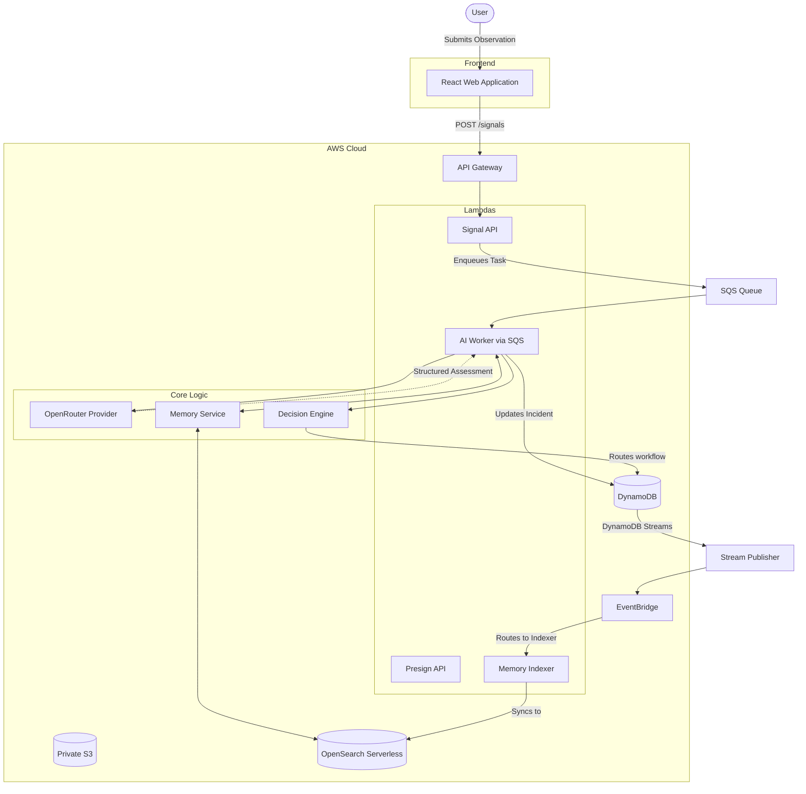

# Report-to-Me AI

**AI-powered guidance for understanding real-world observations and deciding what to safely do next.**

Traditional reporting systems are designed merely to collect forms and build backlogs. Report-to-Me AI is an intelligent interface designed to interpret unstructured human observations, assess potential risks, and provide actionable safety guidance. It acts as a digital safety net, evaluating whether an issue can be safely self-resolved, requires longitudinal monitoring, or demands human authorization and intervention.


## Why Report-to-Me AI?

Traditional reporting systems primarily collect observations. Generic AI assistants can explain an individual situation, but the model itself should not be trusted to directly control sensitive application workflows. 

Tell Report-to-Me AI what is happening. It helps you understand what you can safely do, what you should monitor, and when appropriate human help is needed.

The product follows:
**Understand → Assess → Guide → Monitor → Escalate when appropriate**

The core architectural principle is:
**AI interprets. Software decides. Humans authorize sensitive actions.**

## Core Workflow

### Self-solve
> **"The tap in Classroom 204 is leaking slightly."**

A low-risk, highly actionable observation. The AI assesses this as low severity, and the decision engine routes it to self-solve. The user receives practical guidance on how to secure the area or report it to maintenance, without escalating to an emergency workflow.

### Monitor
> **"An unfamiliar vehicle has been parked near the rear loading dock for two hours."**

An issue that doesn't pose an immediate risk but may develop into one. The AI flags uncertainty or moderate risk factors. The decision engine routes it to monitor rather than immediately escalating. The system may recall past observations of similar vehicles using its OpenSearch memory.

### Human review
> **"A loud noise followed by a power outage in the east wing."**

A higher-risk, sensitive situation. The AI detects critical risk factors and high severity. The deterministic decision engine forces this into a human review queue. The system provides the user with safe guidance but does **not** autonomously contact emergency services or execute sensitive real-world actions.

## Architecture



### AI Pipeline & Provider

The AI Analysis Layer uses a provider abstraction. The current runtime configuration uses **OpenRouter** as the primary inference path to interpret unstructured text and provide structured JSON schema output. The AI strictly interprets the situation—it does not make the final decision.

### Decision Engine

The AI model does not directly control the final workflow state. It acts strictly as an analytical input layer:

```text
AI Provider (OpenRouter)
 ├── understands context
 ├── classifies category
 ├── assesses severity
 └── recommends guidance
         │
         ▼
Deterministic Decision Engine
 ├── self_solve
 ├── monitor
 └── human_review
```

### Safety Model

- **AI output is structured and validated** against strict schemas before processing.
- **Deterministic application logic controls routing.** 
- **AI does not autonomously dispatch police, emergency services, contractors, or other external actors.**
- **Human authorization is required before sensitive external action.** High-risk situations are forced into a human review queue.
- **Severity ≠ Confidence.** The system enforces a strict distinction. A high-severity situation assessed with low confidence requires fundamentally different routing than a high-severity situation assessed with high confidence.

## AWS Architecture

The repository defines an AWS serverless architecture using:

| AWS Service | Purpose |
|-------------|---------|
| **API Gateway** | Managed serverless HTTP entry point supporting CORS and routing. |
| **AWS Lambda** | Event-driven execution without always-on servers. |
| **DynamoDB** | Serverless low-latency structured persistence acting as the absolute source of truth. |
| **S3** | Durable object storage enabling direct, secure browser uploads (evidence). |
| **SQS** | Asynchronous decoupling for AI inference with Dead-Letter Queues for failed processing. |
| **DynamoDB Streams & EventBridge** | Event-driven architecture for reacting to incident state changes. |
| **Step Functions** | Orchestrates secure human review and immutable auditing workflows. |
| **OpenSearch Serverless** | A derived search/memory projection (Lexical/BM25) for querying historical incidents. |
| **AWS SAM** | Reproducible infrastructure as code for serverless resources. |

## Data Model & Response Packet

The backend utilizes DynamoDB Single-Table Design as the authoritative source of truth. OpenSearch Serverless acts solely as a derived projection for historical search. 

When a new observation arrives, the AI pipeline queries OpenSearch via BM25 lexical search to retrieve a `Response Packet`—a structured memory of related past incidents. This provides the AI with institutional memory, allowing it to provide contextual guidance based on historical data.

**Key Schema Overview (DynamoDB):**
- `PK: INCIDENT#<incidentId>`, `SK: META` (Incident State)
- `PK: INCIDENT#<incidentId>`, `SK: SIGNAL#<signalId>` (Raw Signal Payload)
- `PK: INCIDENT#<incidentId>`, `SK: PACKET#<packetId>` (Immutable Response Packet)
- `PK: SIGNAL#<signalId>`, `SK: META` (Pointer for direct signal lookups)

## Evidence Handling

Large media payloads are uploaded directly from the browser to an S3 private bucket via server-generated presigned URLs. Media bytes never pass through the Lambda execution boundary, ensuring the compute tier remains lean and extremely fast.

## Security Principles

- **Private S3 Storage**: All evidence is stored in buckets that explicitly block public access.
- **Presigned Uploads**: The backend strictly controls exactly where and how files are uploaded via short-lived AWS presigned URLs.
- **Server-Generated Object Keys**: S3 keys are securely generated by the server. The browser cannot dictate arbitrary S3 paths.
- **IAM Scoping**: Each Lambda function operates with strictly scoped least-privilege permissions.
- **Secrets Management**: No API keys or sensitive credentials are hardcoded or tracked in git.

## Current Implementation

The repository currently implements the following:
- Unstructured text and image evidence ingestion via React frontend.
- Blob-to-S3 direct presigned uploads.
- DynamoDB single-table incident persistence.
- SQS-decoupled AI Worker processing with OpenRouter integration.
- Deterministic routing decision engine (Self-solve / Monitor / Human-review).
- EventBridge and Step Functions routing for Human Review.
- DynamoDB Streams to EventBridge to OpenSearch Serverless indexing pipeline.

## Known Limitations

- **Infrastructure Deployment**: The repository defines an extensive AWS architecture in `template.yaml`. While the infrastructure code is fully implemented, full deployment requires a properly provisioned AWS account with active limits for services like OpenSearch Serverless.
- **AI Dependencies**: AI output quality and latency depend strictly on the configured external provider (OpenRouter) and model availability.
- **Search capabilities**: OpenSearch is currently implemented using BM25 lexical search. Semantic/vector search is not yet implemented. Furthermore, OpenSearch is an eventually consistent projection derived from DynamoDB Streams.
- **External Interfaces**: The system is an internal decision support tool. It does not autonomously contact emergency services or external vendors.

## Local Development

### Prerequisites
- Node.js 18+
- Python 3.10
- AWS CLI
- AWS SAM CLI (and Docker)

### Backend Deployment

The architecture uses AWS SAM.

```bash
sam build --use-container
sam deploy --guided
```
*(The `--use-container` flag ensures Python dependencies are compiled natively for the AWS Lambda Linux runtime.)*

Set your AI provider credentials in the deployed Lambda environments:
`OPENROUTER_API_KEY=your_key`

After deployment, SAM will output the API Gateway `ApiUrl`. Use this to configure the frontend.

### Frontend

Configure your local environment using the `ApiUrl` output from the SAM deployment.

```bash
cd frontend
cp .env.example .env.local
```

Edit `.env.local`:
```env
VITE_API_BASE_URL=https://<your-api-id>.execute-api.us-east-1.amazonaws.com/v1/api/v1
```

Start the Vite dev server:
```bash
npm install
npm run dev
npm run build
```

## Testing

Backend tests are run via pytest:
```bash
cd backend
python -m venv .venv
source .venv/bin/activate
pip install -r requirements.txt
pytest
```

Frontend UI code builds with strongly-typed TypeScript validation via `npm run build`.

## Project Structure

```text
.
├── backend/
│   ├── app/
│   │   ├── ai/            # OpenRouter provider abstraction
│   │   ├── api/
│   │   ├── domain/        # Core Pydantic classes and domain models
│   │   ├── handlers/      # Lambda entrypoints (API, Indexer, Step Functions)
│   │   ├── repositories/  # DynamoDB persistence layer
│   │   ├── services/      # AI Worker, Decision Engine, Memory Service
│   │   └── utils/
│   ├── tests/
│   └── requirements.txt
├── frontend/
│   ├── src/               # React / TypeScript Application
│   └── package.json
├── template.yaml          # AWS SAM Infrastructure
└── README.md
```

## Design Principles

- **AI interprets. Software decides. Humans authorize.**
- **Observation is not automatically an incident.**
- **Severity is not confidence.**
- **Repeated observations can reveal developing problems.**
- **The safest automation is automation with clear boundaries.**
