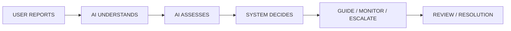
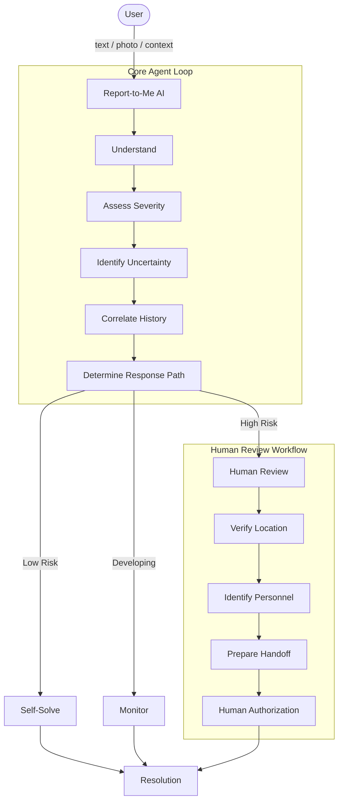
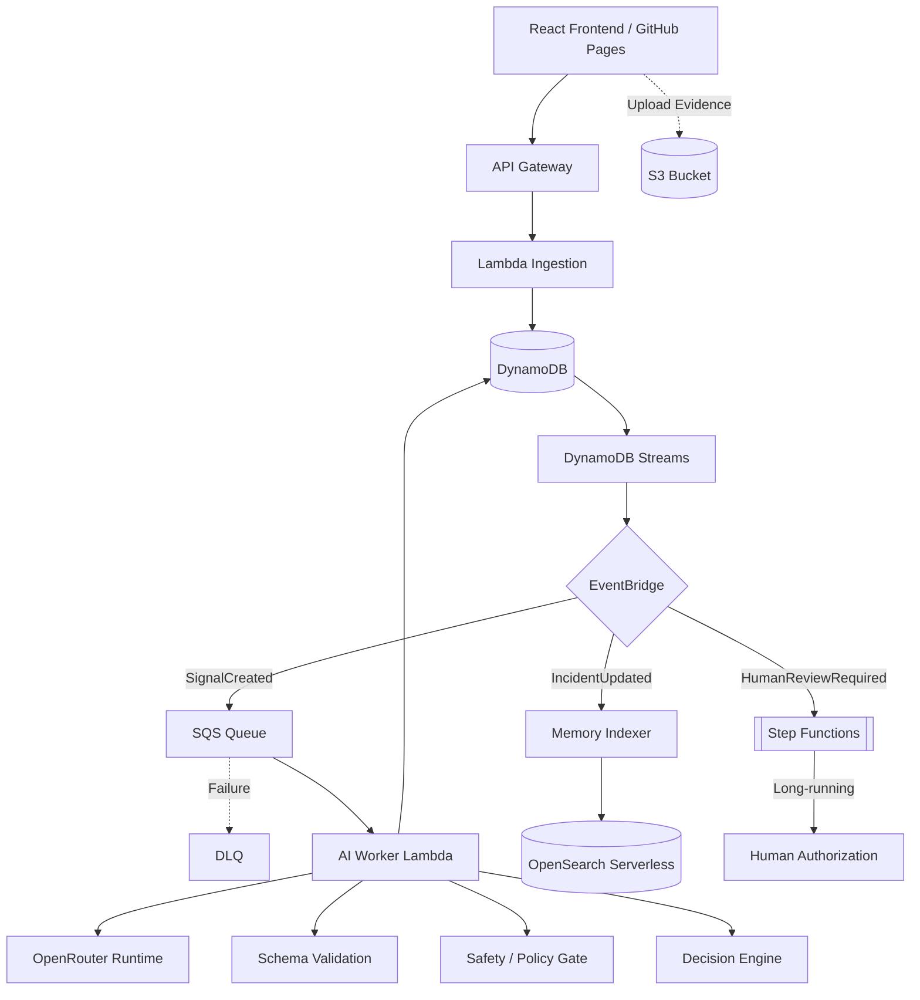
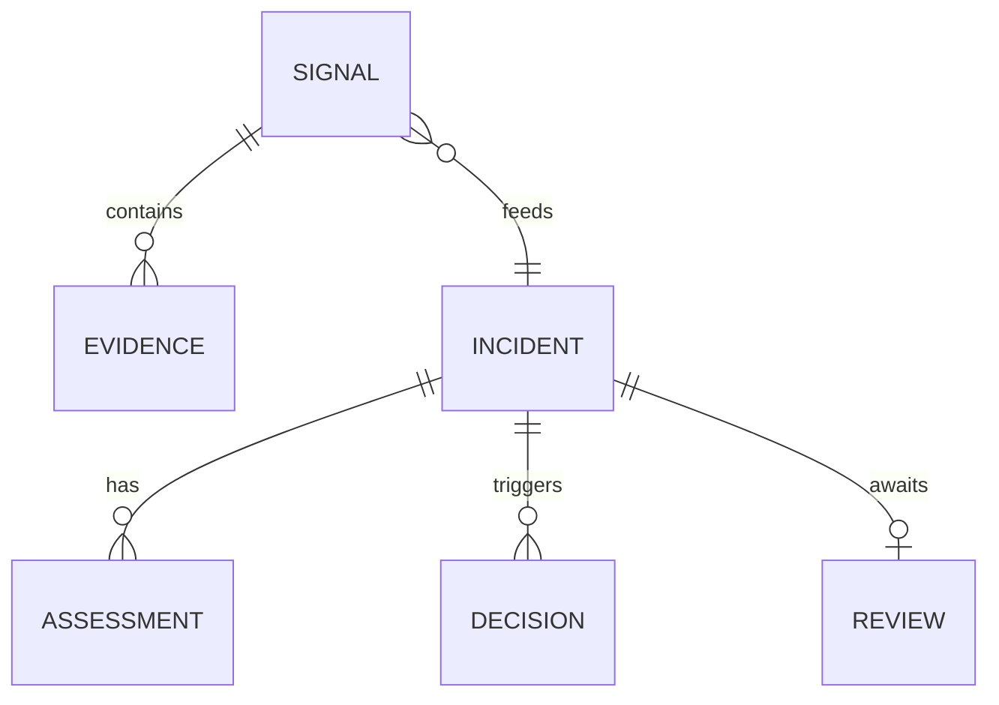

# Report-to-Me AI 🚀

> **Report first. Let the system figure out what happens next.**

Report-to-Me AI is an intelligent, agent-driven incident reporting platform. Instead of forcing users to navigate complex categorical forms or decide which department to contact, the platform simply asks: *What is happening?* 

The AI interprets the messy reality of the observation, assesses its severity, and determines the safest workflow path—providing immediate guidance, monitoring developing situations, or orchestrating a controlled human handoff for high-risk incidents.

---

## 2. Live Prototype
The frontend prototype is currently deployed and accessible:
- **Public URL**: [https://jackso1328.github.io/report-to-me-ai/](https://jackso1328.github.io/report-to-me-ai/)

> [!NOTE]
> This is a functional prototype connected to a real AWS backend and AI inference engine. External actions (such as emergency dispatch) are intentionally simulated for safety.

---

## 3. The Problem
**Real-world problems are messy.**

When an incident occurs, a person might know exactly what to do—or they might have no idea. Sometimes they know something is wrong but don't know who to contact. They might make a poor decision because they lack information. Sometimes a situation develops gradually and becomes more serious over time. Other times, the correct response requires an authorized specialist.

Current systems assume the reporter knows exactly what bucket the problem belongs in, how serious it is, and what workflow to trigger.

---

## 4. The Idea
The core user experience is radically simplified: **"All I need to do is report what is happening."**

The user does not need to know the category, the severity, the responsible team, or the next required action. They simply provide information via text, or optionally attach a photo, video, or audio evidence. 

The AI then understands the situation. 

---

## 5. How Report-to-Me AI Works
Report-to-Me AI is an AI assistant backed by an agentic workflow system. The conceptual workflow is simple:



---

## 6. Agentic Workflow 🤖
Report-to-Me AI is much more than a chatbot answering questions. It is designed to understand a real-world observation, identify uncertainty, and maintain incident state. 

The conceptual agent loop allows the system to route sensitive situations into human review while preserving an audit-oriented record of decisions:



---

## 7. Three Response Modes
The system deterministically routes the AI's structured understanding into one of three distinct modes.

### Low Severity
If the situation is low-risk, sufficiently understood, and actionable, the AI should not unnecessarily involve other people.
* **Example**: "The tap in Classroom 204 is leaking slightly."
* **Response**: The system explains what is happening, what the user can safely do, and who normally handles it.
* **Path**: `OBSERVATION → UNDERSTAND → LOW RISK → SELF-SOLVE GUIDANCE`

### Medium / Developing
If the situation is not an emergency but may require responsible-party involvement or monitoring over time.
* **Example**: "The ceiling fan in Classroom 204 has been making a strange noise repeatedly over several days."
* **Response**: The system identifies the relevant responsible team, prepares the incident information, and maintains context to monitor repeated observations.
* **Path**: `OBSERVATION → CORRELATE → DEVELOPING ISSUE → MONITOR / RESPONSIBLE TEAM`

### High / Critical
If the situation is high or critical risk, the system should not simply give generic advice. It must clearly communicate the risk, identify the appropriate responsible personnel, and safely stage a human handoff.
* **Example**: "There is an active physical fight near the main gate and someone may be injured."
* **Response**: Provides immediate safe guidance, requests explicit location permission, identifies the responsible role, and routes the case to human review.
* **Path**: `OBSERVATION → HIGH/CRITICAL RISK → IMMEDIATE GUIDANCE → LOCATION / CONTEXT → RESPONSIBLE PERSONNEL → HUMAN HANDOFF → HUMAN AUTHORIZATION`

---

## 8. Product Screenshots 📸

### The Agentic Interface (Dark Mode)

*A radically simple interface: "What happened? Tell us what you noticed."*

### The Agentic Interface (Light Mode)

*Clean, cinematic typography and layout built with React and Vite.*

### Human Review Workflow (Dark Mode)

*High-risk situations route to an operational review dashboard rather than a standard chat.*

### Human Review Workflow (Light Mode)

*Displays AI understanding alongside clear operational next steps (location request, responsible personnel).*

---

## 9. What Makes It Different
> **AI interprets. Software decides. Humans authorize sensitive actions.**

This distinction is the strongest technical principle in the project. The AI model is highly capable of interpreting messy real-world observations. However, **the model is not the workflow authority**. 

The model does not directly dispatch emergency services, contact arbitrary people, or change critical workflow state. Instead, AI outputs structured JSON, which is validated, checked against safety policies, and passed to a deterministic decision engine.

---

## 10. AWS Architecture ☁️
The backend is a robust, event-driven serverless architecture built on AWS.



### Infrastructure Components
| AWS Service | What It Does | Why It Exists |
|-------------|--------------|---------------|
| **API Gateway** | Public HTTP API boundary. | Provides secure HTTP access to backend functions. |
| **Lambda** | Serverless compute. | Handles ingestion, AI orchestration, and memory indexing. |
| **DynamoDB** | Incident/Signal state. | Acts as the authoritative source of truth. |
| **DynamoDB Streams** | Change Data Capture. | Turns persisted state changes into events. |
| **EventBridge** | Domain event router. | Decouples downstream capabilities (AI, indexing, workflows). |
| **SQS** | Message queue. | Asynchronous AI processing prevents blocking the ingestion path. |
| **DLQ** | Dead Letter Queue. | Captures failed processing for investigation and recovery. |
| **S3** | Evidence storage. | Private bucket for large media uploads via presigned URLs. |
| **Step Functions** | State Machine. | Orchestrates long-running human-review workflows safely. |
| **OpenSearch Serverless** | Vector/Search database. | Provides derived search and incident memory projection. |
| **CloudWatch** | Observability. | Logging and operational visibility. |
| **AWS SAM** | Infrastructure as Code. | Reproducible, template-driven deployment. |

---

## 11. Why This Architecture?
* **Why DynamoDB?** It is the authoritative, durable source of truth for incident state.
* **Why SQS?** AI inference is asynchronous and should not block the public ingestion path.
* **Why EventBridge?** Domain events allow new downstream capabilities to be added without coupling to the ingestion API.
* **Why Step Functions?** Human review is a long-running workflow that may pause until an authorized decision is made.
* **Why OpenSearch?** It provides a derived search/memory projection while DynamoDB remains the authoritative datastore.
* **Why S3 Presigned Uploads?** Large evidence files do not need to pass through API Gateway or Lambda directly.

---

## 12. AI Architecture 🧠
The system currently uses **OpenRouter** as the inference runtime (utilizing models like Nex N2.5 Pro Free).
The AI is completely abstracted behind a data contract. The `AiWorkerFunction` constructs the context, calls the AI, forces structural compliance, and passes the output to the Decision Engine.

---

## 13. Decision Engine
The Decision Engine is a deterministic piece of software. It evaluates the AI's structured assessment (severity, confidence, risk factors) against hardcoded policies to determine the final workflow path (`self_solve`, `monitor`, or `human_review`).

---

## 14. Safety by Design 🛡️
* **Backend-only secrets**: No API keys are exposed to the frontend.
* **Least privilege IAM**: SAM roles are strictly scoped.
* **Structured AI validation**: AI outputs are strictly coerced and validated against Pydantic schemas.
* **Deterministic Engine**: High-risk situations do not become autonomous AI actions.

---

## 15. Human Review / Handoff 🤝
When the Decision Engine routes an incident to `human_review`, EventBridge triggers a Step Functions execution. This workflow pauses execution until a human authorizer reviews the incident via a dedicated API (`PATCH /api/v1/incidents/{id}/review`). This guarantees the AI can only *prepare* a response, not execute it.

---

## 16. Data Model

* **SIGNAL**: Raw user observation/evidence.
* **INCIDENT**: The AI-understood situation.
* **ASSESSMENT**: Severity, confidence and risk factors.
* **DECISION**: The deterministic workflow path.
* **REVIEW**: The human authorization state.

---

## 17. AI Data Contract
The AI output itself does not directly become workflow authority. It is structured JSON:

```json
{
  "classification": {
    "category": "maintenance",
    "eventType": "equipment_issue"
  },
  "understanding": {
    "summary": "Water is leaking from the sink in the third floor restroom."
  },
  "assessment": {
    "severity": "medium",
    "confidence": 0.91
  },
  "guidance": {
    "recommendedAction": "Place a bucket under the leak if safe.",
    "responsibleParty": "Facilities Management",
    "mode": "monitor"
  },
  "uncertainty": {
    "needsClarification": false
  }
}
```

---

## 18. Product Experience / UI Design
The UI is designed around an **agent workspace** rather than a traditional form.
* **Low risk**: Focuses on actionable guidance and reasoning.
* **Medium risk**: Displays response status and identifies the responsible team.
* **High/Critical risk**: Switches to a wide two-column operational layout (on desktop) featuring clear cards for Human Response Required, Location, Responsible Personnel, and Human Handoff authorization. Location is explicitly requested via browser permission.

---

## 19. What Works Today (Prototype vs Product Vision)
**CURRENT PROTOTYPE:**
The repository implements observation ingestion (text/images via S3), AI understanding, schema validation, the deterministic decision engine, DynamoDB state management, OpenSearch memory indexing, the Step Functions human-review workflow, and a responsive React frontend with explicit location collection.

**PRODUCT VISION:**
The current prototype demonstrates the decision-support and human-handoff workflow. In a production version, the agent could integrate with authenticated responder directories, geospatial service matching, and two-way notification systems. Production integrations would extend this into a closed-loop agent capable of coordinating authorized external actions.

---

## 20. Deployment
* **Frontend**: Hosted globally via GitHub Pages.
* **Backend**: Deployed serverlessly via AWS SAM / CloudFormation.
* **AI Runtime**: Configured server-side using OpenRouter.
All secrets (AWS credentials, OpenRouter keys) are strictly managed via AWS configuration and do not exist in the source code or frontend bundles.

## 21. Local Setup / Getting Started 🛠️

To deploy this project to your own AWS account and run the frontend locally:

### Prerequisites
* AWS CLI installed and configured with appropriate permissions.
* AWS SAM CLI installed.
* Node.js (v18+) and npm installed.
* An [OpenRouter API Key](https://openrouter.ai/).

### Step 1: Deploy the Backend
1. Clone the repository:
   ```bash
   git clone https://github.com/jackso1328/report-to-me-ai.git
   cd report-to-me-ai
   ```
2. Build and deploy the AWS infrastructure using SAM:
   ```bash
   sam build
   sam deploy --guided
   ```
3. During the guided deployment, set `AIProvider` to `openrouter`. Note the **ApiUrl** output at the end of the deployment.
4. Add your OpenRouter API Key securely to the `AiWorkerFunction` Lambda environment variables (or AWS Secrets Manager/SSM, depending on your preferred security posture).

### Step 2: Run the Frontend
1. Navigate to the frontend directory:
   ```bash
   cd frontend
   npm install
   ```
2. Configure your environment variables:
   ```bash
   cp .env.example .env
   ```
3. Edit `.env` and set `VITE_API_URL` to the **ApiUrl** output from your SAM deployment.
4. Start the development server:
   ```bash
   npm run dev
   ```

---

## 22. Testing / Evaluation 📊
The system has been evaluated against various scenarios including:
* Self-solve routing for benign issues.
* Pattern correlation for developing incidents.
* High-risk safety escalations requiring human handoff.
* Policy separation and structured output adherence.

*(See benchmark reports in the repository for specific evaluation logs)*

---

## 23. Technology Stack
| Layer | Technologies |
|-------|--------------|
| **Frontend** | React, TypeScript, Vite, Vanilla CSS, Lucide React, GitHub Pages |
| **Backend** | Python, AWS Lambda, API Gateway |
| **Data** | DynamoDB, S3, OpenSearch Serverless |
| **Eventing** | DynamoDB Streams, EventBridge, SQS, DLQ |
| **Workflow** | AWS Step Functions |
| **Infrastructure**| AWS SAM / CloudFormation |
| **AI** | OpenRouter (Nex N2.5 Pro Free) |

---

## 24. Repository Structure
```
report-to-me-ai/
├── backend/            # Python Lambda functions, API, models, and Decision Engine
├── frontend/           # React / TypeScript Vite application
├── template.yaml       # AWS SAM Infrastructure as Code definition
├── samconfig.toml      # Deployment configuration
├── docs/               # Documentation and images
└── LICENSE             # MIT License
```

---

## 25. Engineering Trade-offs
* **Asynchronous AI**: AI processing is done via SQS to ensure the ingestion API is lightning fast, but this introduces eventual consistency to the frontend (handled via client polling).
* **OpenSearch vs DynamoDB**: DynamoDB is used for strict transactional state and locking, while OpenSearch provides fuzzy lexical memory. 

---

## 26. Known Limitations
This is a prototype boundary:
* **No Autonomous External Dispatch**: The system prepares handoffs but cannot dial 911 or text responders.
* **OpenRouter Latency**: Depending on the selected model, inference times can vary.
* **Lexical Memory**: Memory retrieval currently uses BM25/lexical search, not dense vector embedding.
* **Identity**: The prototype does not yet implement a full authenticated responder directory.

---

## 27. Roadmap / Future Vision 🚀
* **PHASE 1 (Current)**: Observation ingestion, AI understanding, deterministic decision engine, human review, memory.
* **PHASE 2 (Product Vision)**: Connected response (authenticated identities, responder directory, geospatial matching, notifications).
* **PHASE 3 (Product Vision)**: Closed-loop agent (assignment, progress tracking, completion verification, outcome learning).

---

## 28. 3-Minute Demo
To understand the power of the platform, try this sequence:
1. **Report a simple problem** ("The faucet is leaking"). Watch the system give self-solve guidance.
2. **Report a developing issue** ("The elevator sounds like it is grinding again"). Watch it monitor and assign to facilities.
3. **Report a high-risk situation** ("There's a fire in the hallway"). Watch it orchestrate the Human Review workflow, request location, identify safety personnel, and stage the human handoff.

*AI interprets. Software decides. Humans authorize.*

[Demo Video Placeholder]

---

## 29. Design Principles
* Communicate what happened.
* Communicate how serious it is.
* Communicate what to do next.
* Communicate who should handle it.
* Expose what the system is doing behind the scenes.

---

## 30. License
Licensed under the MIT License. See [LICENSE](LICENSE) for details.
